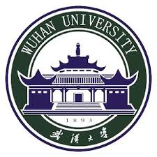

# 余洪江 

## 教育背景

|  |  |   |  |
| :-- | :--: | :--: |--: |
| 2016.09-至今 | {: style="height:30px;width:30px"}| **康考迪亚大学**   电子与计算机工程学院 | 博士 |
| 2012.09-2016.06| {: style="height:30px;width:30px"}|  **武汉大学**   计算机学院 国家多媒体软件工程技术研究中心 | 硕士 (推免) |
| 2008.09-2012.06 |{: style="height:30px;width:30px"}| **武汉大学**   电子信息学院 | 学士 |

研究方向： 语音频处理，主要包括语音增强，语音频质量评价，带宽扩展等

## 专业技能
*	具备语音频信号处理和机器学习的专业知识， 能进行相关的创新性学术研究和工程探索， 包括文献查阅、 算法设计和实现、 系统集成和验证、论文和专利撰写等
*	能熟练使用 Matlab 和 Python 编程， 有PHP、JavaScript、C 等多种语言编程能力
*   熟悉 TensorFlow等深度学习开源框架，音频分析处理软件 Audition
*	能熟练进行英文书面读写和口头交流； 通过TOEFL考试（成绩：98 分）

## 项目经验
|  |  |   |
| :-- | :--: | --: |
|** 1. 智能家居中基于深度神经网络的语音增强算法研究** | 主要参与者 | 2018.01-至今 |

*	**项目描述：** 加拿大自然科学和工程研究理事会（NSERC）研究项目，和Microchip公司及麦吉尔大学合作。语音指令作为智能家居中重要的信息载体，其质量影响着智能设备的服务性能。项目主要将深度神经网络引入传统语音增强算法中，消除背景噪声提升带噪语音的质量和可懂度，从而提高智能设备的关键字识别和语音识别准确度
*	**职责：** 本人负责算法设计和代码实现，主要工作包括1）利用深度神经网络预测卡尔曼滤波中的语音线性预测系数，优化基于卡尔曼滤波的语音增强算法。2）利用卷积神经网络同时增强语音幅度谱和相位谱，改善传统算法只针对幅度谱进行增强问题

|  |  |   |
| :-- | :--: | --: |
|** 2. 面向阵列前端算法的语音客观评价体系 ** | 参与者 | 2018.07-2019.06 |

*	**项目描述：** 小米公司-武汉大学人工智能联合实验室项目。项目研究不同唤醒算法对前端的要求，以语音唤醒率为系统目标前提下，建立对阵列前端算法的语音客观评价标准
*	**职责** 本人主要负责申请书的撰写工作。项目获批后负责现有语音客观评价算法的调研和阵列前端增强算法的设计

|  |  |   |
| :-- | :--: | --: |
|** 3. 基于麦克风阵列的语音去噪、去混响和分离算法研究 ** | 参与者 | 2016.09-2017.06 |

*  **项目描述:** 加拿大自然科学和工程研究理事会（NSERC）研究项目。项目利用子带分解、语音幅度估计等算法解决麦克风阵列信号的去噪以及去混响的问题
* 	**职责：** 本人主要负责基于子带分解的卡尔曼滤波语音增强算法的研究

|  |  |   |
| :-- | :--: | --: |
|** 4. 基于听觉关注度的音频质量客观评价技术研究** | 主要参与者 | 2013.11-2014.12 |

* 	**项目描述：** 国家自然科学基金青年项目。针对在复杂声场中，传统的音频质量评价方法与真实主观听觉感受存在较大差异的问题，建立符合人类心理选择机制的客观质量评价模型
*	**职责:** 本人负责算法设计、代码实现和结题报告。将听觉关注度参数引入传统的音频质量评价算法PEAQ (Perceptual Evaluation of Audio Quality)，提高客观得分与主观得分的拟合度

## 学术成果
### &diams; 会议论文

[1]. 	**H. Yu**, W.-P. Zhu, and B. Champagne. “Subband Kalman Filtering with DNN Estimated Parameters for Speech Enhancement.” *INTERSPEECH*, 2020. (Accepted)

[2]. 	**H. Yu**, W.-P. Zhu, and Y. Yang. “Constrained Ratio Mask for Speech Enhancement Using DNN.” *INTERSPEECH*, 2020. (Accepted)

[3]. 	**H. Yu**, W.-P. Zhu, and B. Champagne. “High-frequency Component Restoration for Kalman Filter Based Speech Enhancement.” *IEEE International Symposium on Circuits and Systems (ISCAS)*, 2020. (Accepted)

[4]. 	**H. Yu** and W.-P. Zhu. “Deep Neural Network Based Complex Spectrogram Reconstruction for Speech Bandwidth Expansion.” *IEEE International NEWCAS Conference*, 2020. (Accepted)

[5]. 	**H. Yu**, Z. Ouyang, W.-P. Zhu, B. Champagne, and Y. Ji. “A Deep Neural Network Based Kalman Filter for Time Domain Speech Enhancement.” *IEEE International Symposium on Circuits and Systems (ISCAS)*, pp. 1-5. 2019.

[6]. 	Z. Ouyang, **H. Yu**, W.-P. Zhu and B. Champagne. “A Fully Convolutional Neural Network for Complex Spectrogram Processing in Speech Enhancement.” *IEEE International Conference on Acoustics, Speech and Signal Processing (ICASSP)*, pp. 5756-5760. 2019.

[7]. 	Z. Ouyang, **H. Yu**, W.-P. Zhu and B. champagne. “A Deep Neural Network Based Harmonic Noise Model for Speech Enhancement.” *INTERSPEECH*, pp. 3224-3228. 2018.

[8]. 	Y. Yang, **H. Yu**, R, Hu, et al.  “Auditory Attention Based Mobile Audio Quality Assessment.” *IEEE International Conference on Acoustics, Speech and Signal Processing (ICASSP)*, pp. 1389-1393. 2014.

## 在校荣誉
|  |    |
| :--  | --: |
|Concordia Merit Scholarship|2016-2017|
|Concordia International Tuition Award of Excellence| 2016|
|**研究生国家奖学金（2次）**|2014， 2015|
|国家研究生数学建模竞赛 三等奖|2015|
|国家研究生电子设计竞赛商业计划书专项赛 三等奖（队长）|2015|
|**国家研究生数学建模竞赛 一等奖（队长）**|2014|
|**武汉大学 优秀毕业生**|2012|
|武汉大学 乙等奖学金（2次）|2011， 2009|
|武汉大学 社会活动积极分子（2次）|2011，2009|
|武汉大学 “我在学生会的日子”征文比赛 三等奖|2009|

## 学生工作
* 研究生任职： 班级团支书， 组织国家多媒体软件工程技术研究中心春节晚会
* 本科任职： 班长， 院学生会理论社团部长

## 自我评价
* 性格开朗，具备良好的合作精神， 有较好的学习、沟通和写作能力
* 热爱运动， 包括排球，游泳和跑步
